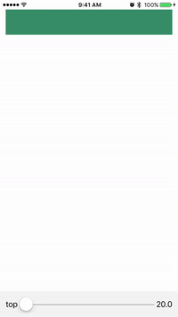
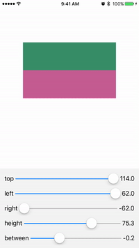
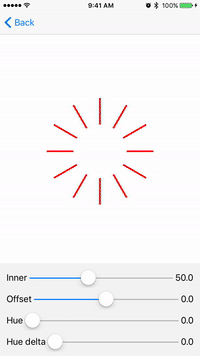

# Prototyping with UISliders

### What can I do with this?
- Dynamically adjust `NSLayoutConstraint`s or custom variables using `UISlider`

## Examples
### Basic constraint

```swift
// Adjust the constant of the top anchor of the green view
let constraint = topView.topAnchor.constraint(equalTo: view.topAnchor, constant: 20))
SliderFactory.main.addSlider(named: "Top", for: constraint, minValue: 20, maxValue: 64)
```

### Multiple constraints

```swift
// Store the constraints we want to be adjustable in an array
let adjustableConstraints = [
  ("top", topView.topAnchor.constraint(equalTo: view.topAnchor, constant: 64)),
  ("left", topView.leftAnchor.constraint(equalTo: view.leftAnchor, constant: 12)),
  ("right", topView.rightAnchor.constraint(equalTo: view.rightAnchor, constant: -12)),
  ("height", topView.heightAnchor.constraint(equalToConstant: 53.0)),
  ("between", bottomView.topAnchor.constraint(equalTo: topView.bottomAnchor, constant: 20)),
]
for (name, constraint) in adjustableConstraints {
  // Activate each one
  NSLayoutConstraint.activate([constraint])
  let min = constraint.constant - 50
  let max = constraint.constant + 50
  // Let the factory create a slider for each constraint
  SliderFactory.main.addSlider(named: name, for: constraint, minValue: min, maxValue: max)
}
```

### Custom variables

```swift
// Provide a pointer to variable of interest and a callback function
SliderFactory.main.addSlider(named: "Inner", for: &circleView.innerRadius, minValue: 30, maxValue: 80, cb: circleView.setNeedsDisplay)
SliderFactory.main.addSlider(named: "Offset", for: &circleView.offset, minValue: -CGFloat.pi, maxValue: CGFloat.pi, cb: circleView.setNeedsDisplay)
SliderFactory.main.addSlider(named: "Hue", for: &circleView.initialHue, minValue: 0, maxValue: 1, cb: circleView.setNeedsDisplay)
// ...
```

## How do I use this?
The interesting file is [SliderFactory.swift](Sources/SliderFactory.swift).

1. Include it in your project
2. Call `SliderFactory.main.show(in: viewController.view)`
3. Add sliders by calling `SliderFactory.main.addSlider(*)` methods


You can find my blog post [here](https://jerryyu.ca/blog/25)
